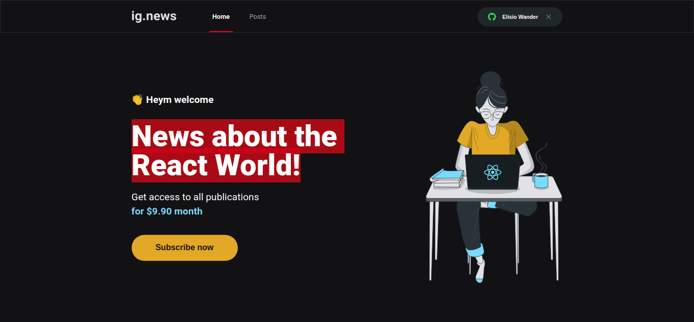
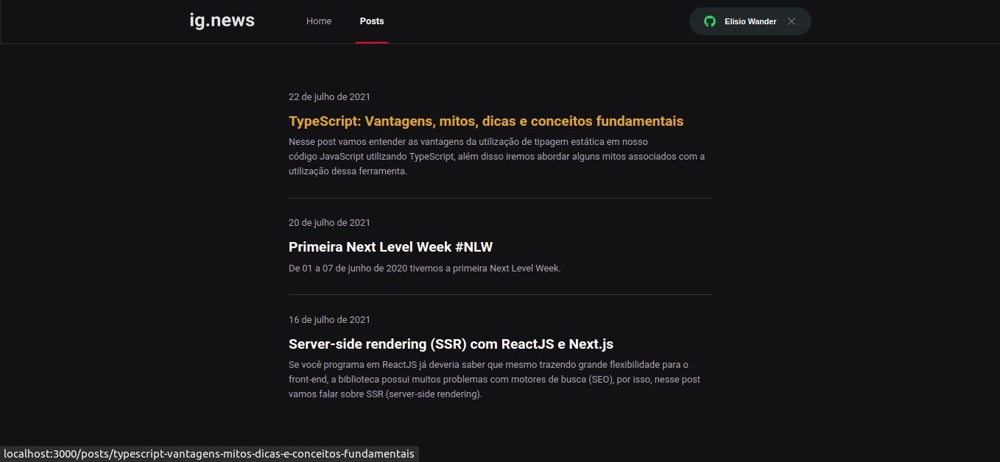
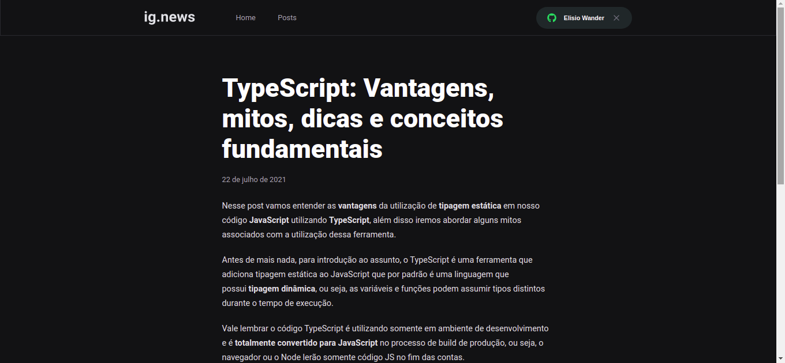
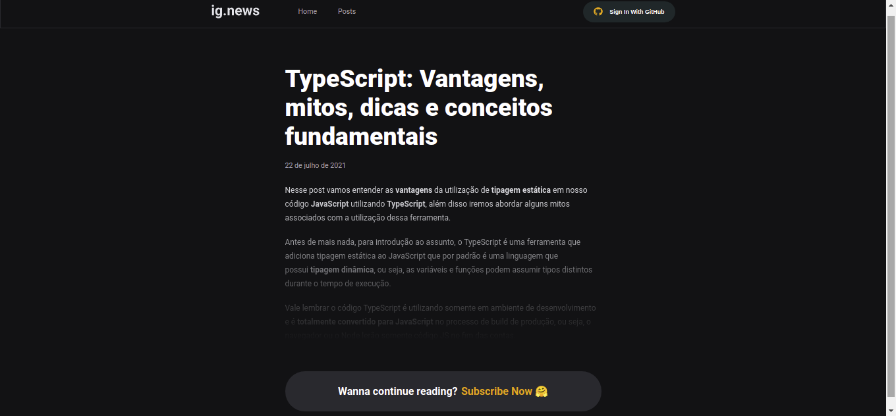
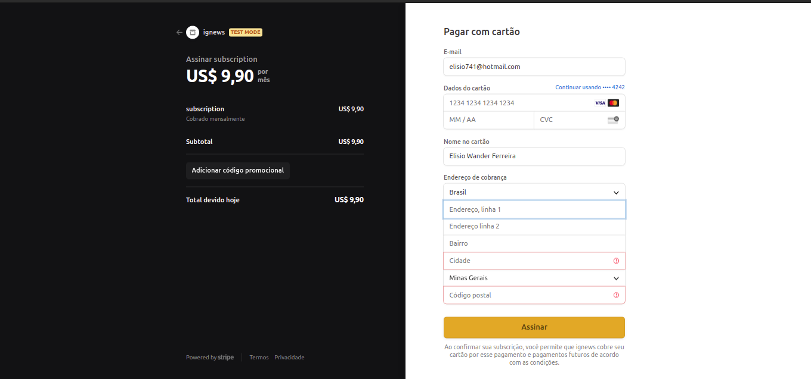

<h1 align="center">
    
</h1>

<h1 align="center">
    
     
     
    
      
</h1>

## 🏷️ Sobre 
**Ig.news** é uma plataforma de assinatura paga para quem gosta de consumir artigos e posts sobre assuntos diversos.
Enquanto o usuário assinante pode consumir quantos posts ele quiser, o usuário não assinante tem apenas uma prévia do post que deseja acessar.

---

## 🛠️ Tecnologias e serviços utilizados
Foram utilizadas as seguintes tecnologias para desenvolver a aplicação **Ig.news** :

- [Next](https://nextjs.org/)
- [Typescript](https://www.typescriptlang.org/)
- [Sass](https://sass-lang.com/)
- [Stripe](https://stripe.com/br)
- [FaunaDb](https://fauna.com/)
- [Prismic](https://prismic.io/)

---

## 🗂️ Como baixar e iniciar o projeto 

```bash

    #clonar o projeto
    $ git clone https://github.com/ElisioWander/ignews-to-deploy.git

    #entrar no diretório
    $ cd ignews-to-deploy

    #instalar as dependências
    $ yarn

    #iniciar a aplicação
    $ yarn dev
```
### Servidor local
localhost:3000

---

## ⚠️ ALERT ⚠️
Lembrando que será necessário criar uma conta no [Stripe](https://console.firebase.google.com/) e um produto que corresponde a um tipo de assinatura.

Também é necessário criar uma conta no fauna [FaunaDB](https://fauna.com/) e estruturar as seguintes Collections e indexes:
### Collections
- subscriptions
- users 

### Indexes
- subscription_by_id
- subscription_by_status
- subscription_by_user_ref
- user_by_email
- user_by_stripe_customer_id

Também é necessário criar uma conta no [Prismic](https://prismic.io/) e seguir os seguintes passos: 

- Iniciar um repositório
- Configurar a Role como developer
- Configurar a tecnologia utilizada como Next.js
- Criar um custom type como "Repeatable Type" com o nome "Post"
- Configurar a publicação contendo os seguintes elementos como obrigatórios: UID, title e RichText 

---

## Autor
### 👤 Elisio Wander

- Linkedin: [@elisioWander](https://www.linkedin.com/in/elisio-wander-b88b69136/)
- github: [@elisioWander](https://github.com/ElisioWander)

---
## 📝 Licença
Copyright © 2020 [@ElisioWander](https://github.com/ElisioWander/ignews-to-deploy/blob/main/LICENSE)

Este projeto está sobe a [LICENÇA MIT](https://opensource.org/licenses/MIT)

---

### Desenvolvido 💜 by Elisio Wander
